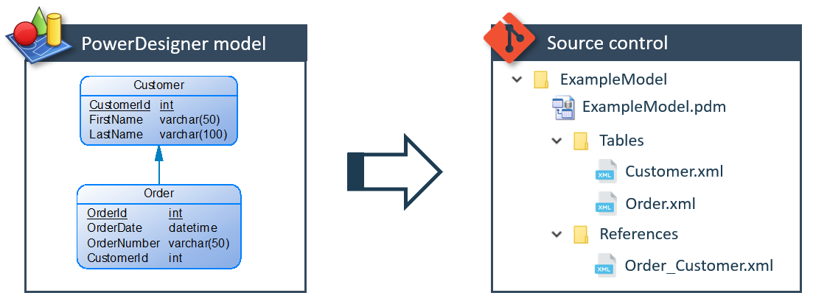

# Introduction
This wiki contains the documentation of PowerDeComposer.

## Why did we create PowerDeComposer?
As CrossBreeze we use [SAP PowerDesigner](https://www.sap.com/products/powerdesigner-data-modeling-tools.html) a lot for creating logical and physical data models which contain structure and lineage of a data solution. Part of the PowerDesigner product is the PowerDesigner repository with which you can version you models and be able to work on the same model at the same time with multiple members of your team.
Sadly there are quite some drawbacks when using the repository. Some of them are:

- When using branches in the PowerDesigner repository and integrating changes into another branch will sometimes result in mappings gone missing.
- When using a project to contain multiple models and in a branch a model is removed, the model is removed in all branches.
- Integrating changes for multiple models takes a lot of time. When there are no conflicting changes it still needs manual integration.

Since we experienced these issues with the repository in multiple customer cases we came up with an alternative for version management of a PowerDesigner model.

## What is PowerDeComposer?
To try to resolve the issues mentioned above we want to be able to use any existing source control system, like Git, Subversion, TFS, etc. The latter are all file based. Since a single model in PowerDesigner is stored in a single file we thought of decomposing the PowerDesigner model file into separate files and directories according to the XML structure of the PowerDesigner model. This so we can compose the original file using the decomposed files and directories. This way we can go back and fourth, so still being able to edit the model files in PowerDesigner and also able to manage the decomposed model files in a version control system.

PowerDeComposer is a utility with which you can decompose any PowerDesigner model (tested with LDM & PDM) into, and compose a PowerDesigner model from, a collection of files and directories.

## Documentation Shortkeys

| Shortkey | Description |
|:---      |:---         |
|<kbd>F</kbd> or <kbd>S</kbd> | Press the <kbd>F</kbd> or <kbd>S</kbd> key to start searching. |
| <kbd>Shift</kbd> + mouse scroll[^1] | Press the <kbd>Shift</kbd> key while scrolling to scroll horizontally. |

[comment]: Footnotes
[^1]: This can be handy when a code example is wide and doesn't fit within the boundaries of the page.